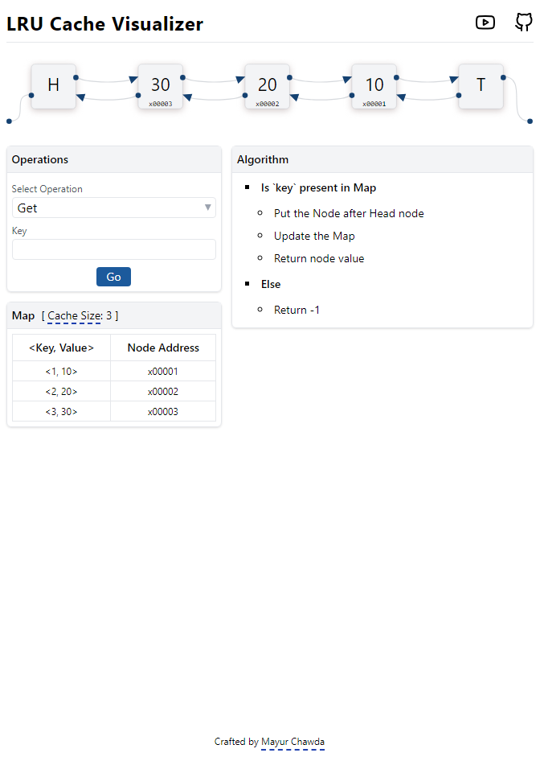

# 
LRU-Cache Visualizer

This is my attempt to create a visualizer of LRU (Least Recently Used) Cache. I gained knowledge about LRU Cache from a comprehensive video tutorial by [Raj Vikramaditya](https://www.youtube.com/@takeUforward), which can be found [here](https://youtu.be/xDEuM5qa0zg).

You can watch it in action [here](https://lrucache.netlify.app)
 

## Overview

The purpose of this visualizer is to provide an interactive and illustrative representation of how the LRU Cache algorithm works. By visualizing the caching process, it becomes easier to understand and grasp the underlying concepts and mechanisms.

 

## Technologies

- [React.ts](https://react.dev/) - UI Library
- [Vite.js](https://vitejs.dev/) - Bundler
- [Tailwind CSS](https://tailwindcss.com/) - Styling
- [React-Spring](https://www.react-spring.dev/) - Animation
- [Zustand](https://docs.pmnd.rs/zustand/getting-started/introduction) - State Management

 

## Run in your local

- `git clone https://github.com/mayur124/lru-cache.git`
- `yarn install`
- `yarn start`

 

## Screenshots

 

 

 

